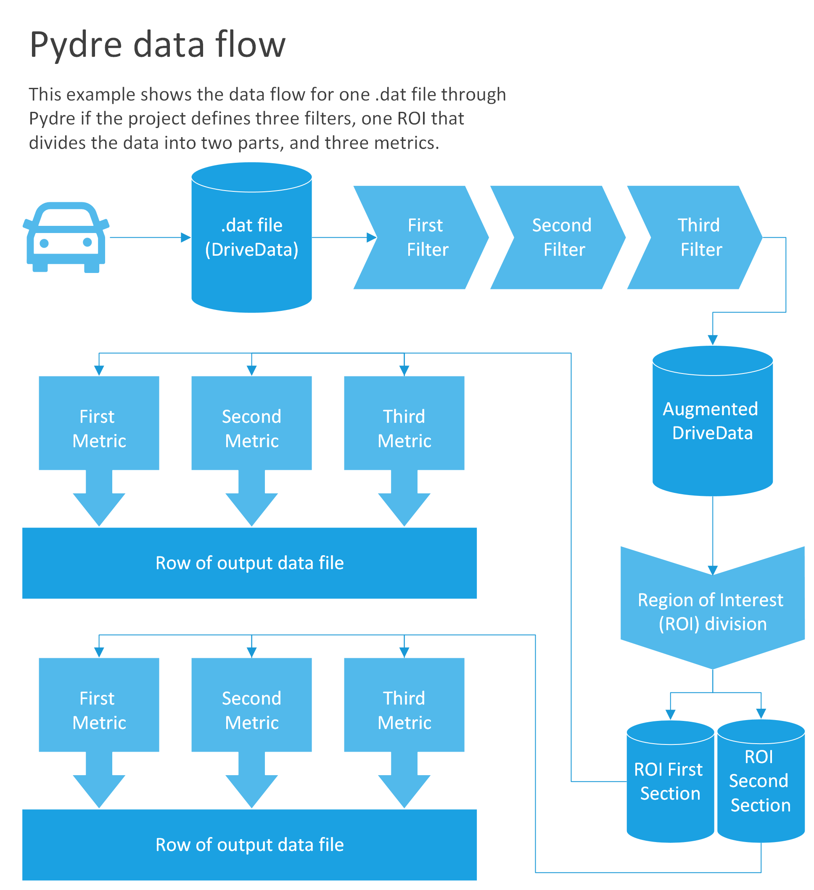

# Pydre documentation

# Goals

Pydre is a software package designed to analyze driving data taken from driving simulation research studies. Specifically, it was built around the data file format generated by SimObserver, which is software sold by Realtime Technolgies for recording data from their SimObserver simulation system. 

SimObserver collects information during the simulation drive, such as vehicle speed and following distance.  This information is collected every 1/60th of a second, which results in tens of thousands of rows for a study session. This data is often processed into specific metrics that look at trends, averages or other quantities that are determined by looking at longer periods of time. This is what Pydre was designed to do. 

Pydre takes a drive data file with data that is difficult to interpret in raw form and applies filters and metrics to create a file that can be more easily used for statistical analysis in R (or other similar tools).

# Structure

Pydre works by reading in `.dat` files (creating DriveData objects), then applying filters, region of interest splitters and metrics to each one.

## Filters

Filters add or modify data in DriveData objects, creating new columns or smoothing data. They are used to number events that are represented by binary values, convert eye tracking data into fixations or to create divisions in the data for use in region of interest processing. The augmented drive data object is passed along the pipeline in place of the original one. The order of the filters matter: the filters give their output data to the next filter in the list.

## Region of interest (ROI) divisions

Regions of interest (ROIs) represent different partitions of the data where the same metrics are applied on every partition. This is useful in processing a within-subjects or repeated measures experiment where multiple similar or different events happen in the same drive. For example, multiple obstacle interactions or testing driver distraction while performing different in-vehicle tasks would both be good examples of ROI usage. 

ROIs can be defined in terms of spatial areas, regions of time, or columns. Using data columns is the most controllable version of ROIs, and a new DriveData object is created consisting of the rows that match each unique element of that column. For example, if a column `Task` had values of `[2, 2, 2, 3, 3, 2]`, two DriveData objects would be created: one with all the rows with the `Task` value *2* and one with all the rows with the `Task` value *3*.

## Metrics

Metrics create summary statistics from DriveData objects. They do not change the content of the object, but return values like the mean of a particular column or the response time of breaking after a certain event. A single metric can return one or more summary statistics. All the metric outputs for each ROI for each `.dat`  input file create one row of the output file. 

## Project Files

Project files are JavaScript Object Notation (json) marked-up files that dictate things like which region of interest (ROI) should be tested and which metrics should be gathered. A project file should consist of two main parts: the rois array and the metrics array. Each element of the rois array should have a field to tell which type of ROI the element is (rect or time) and a corresponding file name with a path to a csv file with the relevant information for a region. Time and Space are currently the only two ROI types implemented. Their formats are detailed below. 

As for metrics, the array should consist of elements containing every function that you wish to analyze. There are a minimum of two required fields: "name" and "function". "Name" is the column header for the metric in the output file and "function" is the name of the function you wish to call in Pydre. Then, any arguments required for the function must be specified. 

Multiple functions can be called within one project file.  The result of each function will be outputted in a separate column of the generated csv file.

To see an example project file, look at bushman_pf.json in the docs directory of the pydre folder.    

  
