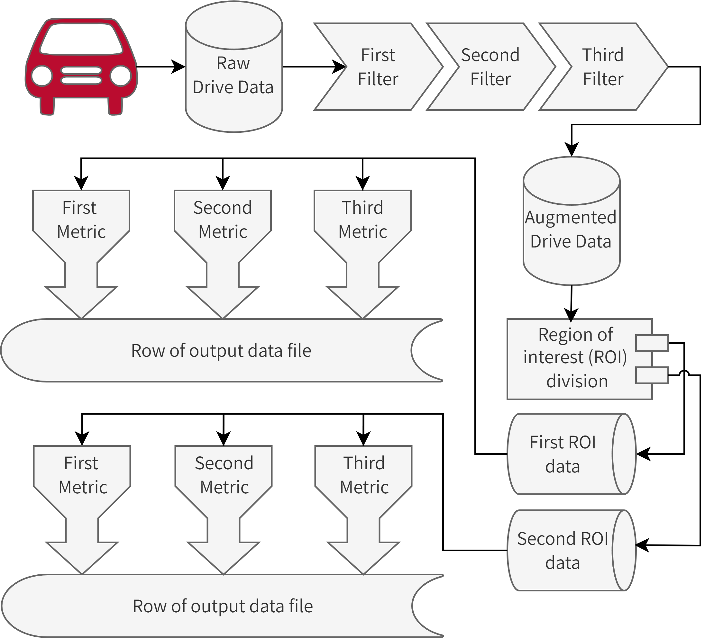

# Summary

The Python package *Pydre* (pronounced pie-dray), provides a cohesive framework for data reduction in the context of driving simulation. 

# Statement of need

Driving simulators are complex pieces of equipment that are extremely valuable in experimental studies on driving behavior. Simulation technology in general is very useful when doing things in real life is too dangerous or too expensive. The types of experimental conditions desired by scientists investigating driving behavior are often both of these things.

The driving simulators commonly used for the investigation of driving behavior generate a moderate amount of time series data (recorded at 30Hz or more) for each scenario run on the sim. Investigators often want to convert that time series data to discrete metrics that describe a specific aspect of how the driver interacted with the vehicle during the drive. These metrics need to be calculated for all participants in a study, and often for multiple scenarios per participant. 

This is a necessary component of the most common type of driving-data based analysis of participant simulator performance. This work could be accompblished by bespoke processing scripts for a particular project. However, these one-off scripts are often not taken seriously as reusable code and can lead to fragile software projects that can not be easily shared between researchers, even at the same lab. In addition, many approaches using multi-stage processing with multiple programs can lead to intermediate data files and data pipelines that can lead to running code on the incorrect "stage" of the data.

*Pydre* attempts to avoid the problems above by offering a unified, modular architecture for reducing data from driving simulators into discrete metrics. It is a single application, designed to be used by all projects and share code among them. The modularity allows different users to add new filters or metric-calculating functions in a separate python file and eventually test and document that code, incorporating it into the general library and allowing easy use for other studies.

# Architecture 

In using Pydre to perform data reduction, researchers write a project file describing the data filters, regions of interest (ROIs), and metric functions that will be applied.  

## Data filters

Data filters augment a raw data file from the sim with additional or changed data. They perform tasks such as merging external data or convert binary marker columns into sequential numbers for ease of later processing. They can also be used to turn raw eye tracking data into fixation numbers. 

These filters fulfill the role of data pre-processing in other workflows, but with the Pydre architecture, this is all done in memory with no intermediate files. 

## Regions of interest

Regions of interest (ROIs) are partitions of the driving data. This is especially useful in repeated-measures experiments, but is also important to remove irrelevent parts of the driving scenario or to focus in on a critical event in the roadway. Two ROI types currently implemented are column ROIs, where the data is partitioned based on flags in the data, often set by scenario scripts or manual switches toggled during the scenario run. Bounding regions, or spatial ROIs, constrain metrics to be calculated in specific regions of the roadway. This can be useful when calcuating metrics for a crosswalk zone, a construction zone or other zone that is constrained in physical space.

## Metric functions

Metric functions are those that output the traditional values used to evaluate driving performance in simulation and real-world driving. This includes mean speed, standard deviation of speed, standard deviation of position, steering reversal rate and time above speed limit. The API of metrics provides a standard interface for all items, making it easier for researchers to write new metric functions and reuse metrics in flexible ways.

# Extensibility

Although there are various real-time interactive driving simulation software systems in use in academic and industry settings, they use very similar tabular, CSV-like, time-series data formats.

# Acknowledgements

The authors would like to thank the many undergraduate researchers who have used and provided feedback on previous versions of the software.

# References