# pydre_run.py

Pydre is software used to analyze data collected from studies. When experiments are run in the simulator, the program SimObserver collects information on the drive, such as vehicle speed and following distance. This information is gathered every 1/60th of a second, which results in many data points. These data points can be analyzed by examining trends over longer periods of time, and this is done through Pydre. Pydre takes a file with data that is difficult to interpret in the form it comes in and then converts it into a much more comprehensive format (i.e. Excel).

This script is a front end application that allows the user to analyze data using command line arguments.

The user must enter the path for the project file and data file in order to aggregate the data. The user has the option of specifying an output file name, to which the test results will be saved. If no output file name is given the output will save to _"out.csv"_ by default. A brief description of the aforementioned arguments is offered below.

Command Line Arguments:

-   Project File [-p]: The project file specifies a file for the regions of interest from which the data should be aggregated. It also specifies a list of metrics (the type of data) that will be aggregated from the regions of interest.
-   Data File [-d]: The data file contains the raw metrics obtained from the simulation.
-   Ouput File [-o]: After the script has executed, the output file will display the aggregated metrics from the regions of interests that were both specified in the project file. The output file will be saved in the same folder as the script.
-   Logger level [-l]: This defines the level the logger will print out. The dafault is 'Warning'. Options include debug, info, warning, error, and critical.

Command Line Syntax: `python pydre_run.py -p [project file path] -d [data file path] -o [output file name] -l [warning level]`

Example execution:
'python pydre_run.py -p C:\Users\pveith\Documents\pydre\docs\bioptics.json -d C:\Users\pveith\Documents\bioptics\pydreDataSet\*.dat -o bioptics.csv -l debug'

For additional assistance while running the script use the help command (-h)

# Regions of Interest (ROIs)

Each region of interest is an area of data that the user is interested in examining. This can include things such as where the car starts on the track, when the car hits a traffic jam, when the car hits construction, etc.

# Project Files

Project files are JavaScript Object Notation (json) marked-up files that dictate things like which region of interest (ROI) should be tested and which metrics should be gathered. A project file should consist of two main parts: the rois array and the metrics array. Each element of the rois array should have a field to tell which type of ROI the element is (rect or time) and a corresponding file name with a path to a csv file with the relevant information for a region. Time and Space are currently the only two ROI types implemented. Their formats are detailed below.

As for metrics, the array should consist of elements containing every function that you wish to analyze. There are a minimum of two required fields: "name" and "function". "Name" is the column header for the metric in the output file and "function" is the name of the function you wish to call in Pydre. Then, any arguments required for the function must be specified.

Multiple functions can be called within one project file. The result of each function will be outputted in a separate column of the generated csv file.

To see an example project file, look at bushman_pf.json in the docs directory of the pydre folder.

# ROI CSV File Formats

For analysis, it is often useful to define ROIs in the data. Pydre uses csv files to define spatial and temporal ROIs.
The spatial regions are defined over the scenario course, while the temporal regions are defined per subject.

#### Time ROI table format

| Subject | _ROI name 1_ | _ROI name 2_ | ... | _ROI name N_ |
| ------- | ------------ | ------------ | --- | ------------ |
| 1       | _time range_ | _time range_ | ... | _time range_ |
| 2       | _time range_ | _time range_ | ... | _time range_ |
| ...     | ...          | ...          | ... | ...          |
| N       | _time range_ | _time range_ | ... | _time range_ |

_*NOTE*: Time Ranges are formatted as `hh:mm:ss-hh:mm:ss#driveID` If multiple drives are used in a particular ROI, simply add a space and write in another time range in the same cell._

#### Space ROI table format

| ROI        | X1      | Y1      | X2      | Y2      |
| ---------- | ------- | ------- | ------- | ------- |
| _ROI name_ | _min x_ | _min y_ | _max x_ | _max y_ |
| _ROI name_ | _min x_ | _min y_ | _max x_ | _max y_ |
| ...        | ...     | ...     | ...     | ...     |
| _ROI name_ | _min x_ | _min y_ | _max x_ | _max y_ |

Note: -Z corresponds to positive X, and if Y is 0 in the WRL file, set Y1 = -100, Y2 = 100.

The ROI will consist of the area inside the max_y - min_y and the max_x - min_x.

For an example file, look at spatial_rois.csv in the main pydre folder. Once the ROI csv file has been generated, reference it in the project file (as seen in bushman_pf.json) to perform the function calculations only on the regions of interest specified by the x and y coordinates in this csv file.

# pydre/core.py

This script contains code that is intergral to the pydre module

### DriveData

This is the unit of data storage for the module. Each DriveData object contains a singular SubjectID, a list of DriveIDs, a single (optional) region of interest, a list of Pandas DataFrames created from the associated.dat files, and a list of the source file names.

-   SubjectID: Unique identifier for this object. Any file loaded into a DriveData object should ONLY be data from this subject number, however, this is not currently enforced
-   DriveID: List of all of the drive ids for each DataFrame in the DriveData object
-   roi: Singular string denoting the region of interest of the particular DriveData. There can currently only be one region of interest per DriveData object
-   data: List of the DataFrames corresponding to each drive from the DriveIDs
-   sourcefilename: The names of each source file used in the data argument

### `SliceByTime()`

This is a simple helper method to take a particular data frame and trim it to only entries that fall within a given range of times.

### `MergeBySpace()`

This is a utility to merge an ordered list of DriveData objects based on the point where the beginning of the next is closest (by X,Y position) to the end of the most previous DataFrame. The input should all be from the same subject, same region of interest, and should go in a logical order. The output will be a DriveData object with one element in the data list. The drive IDs and source file names of the outputted DriveData object will simply be an aggregation of all drive IDs and source files from the input list.

# pydre/project.py

This is where the processing actually takes place. The only functions that should be called outside of the project.py class are `__init(projectfilename)__`, `run(datafiles)`, and `save(outfilename)`. The basic idea is that "init" will load the json projectfile, "run" will convert all of the datafiles into DriveData objects and do all of the processing specified in the json file, and "save" will write all of the results to a csv file. For further details, investigate the project.py script.

# pydre/rois.py

Contains functions to read ROI csv files referenced by the project file. These functions take that ROI data and a list of drive data objects, extract the data that falls within the region, and return a new list of DriveData objects with only the pertinent information.

### `TimeROI.__init__(filename, nameprefix="")`

Creates a new Time ROI object. filename is the file containing the rois.

### `TimeROI.split(datalist)`

Grabs relevant parts of a list of DriveData objects based on the filename used to create the object.

### `SpaceROI.__init__(filename, nameprefix="")`

Creates a new Space ROI object. filename is the file containing the rois.

### `SpaceROI.split(datalist)`

Grabs relevant parts of a list of DriveData objects based on the filename used to create the object.

# pydre/metrics.py

Contains all functions for getting data metrics out of the DraveData DataFrames. The functions that are defined in the json projectfile are called from during project.py's run function. Each metric takes in a DriveData obejct, processes it, and returns the value of the metric. Currently, the following functions are implemented (with additional arguments described beneath):

-   `meanVelocity(data, cutoff)`
    -   data: the DriveData to be analyzed.
    -   cutoff: the minimum velocity to be counted in the average
-   `steeringEntropy(data)`
    -   data: the DriveData to be analyzed.
-   `tailgatingTime(data, cutoff = 2)`
    -   data: the DriveData to be analyzed.
    -   cutoff: The largest value of headway time (in seconds) that counts as tailgating.
-   `tailgatingPercentage(data, cutoff = 2)`
    -   data: the DriveData to be analyzed.
    -   cutoff: The largest value of headway time (in seconds) that counts as tailgating.
-   `brakeJerk(data, cutoff = 0)`
    -   data: the DriveData to be analyzed.
    -   cutoff: Smallest amount of jerk to be counted
-   `boxMetrics(data, cutoff = 0, stat = "count")`
    -   data: the DriveData to be analyzed.
    -   cutoff: Smallest amount of jerk to be counted
    -   stat: statistic to compute, either "count" for the number of times the participant identified the box within 2 seconds, "mean" for their mean reaction time, or "sd" for the standard deviation of their reaction time. Used for Anna's hearing impaired study.

# pydre GUI

The GUI for pydre allows users to visually interface with and run the pydre application. 

To run the GUI:

-   Navigate to the pydre directory (NOT the GUI directory)
-   Comand Line Syntax: `py -m gui.app`
-   If missing libraries run: `pip install -r requirements.txt`

## Start Page

Below is a Screenshot of the Start Page for pydre GUI

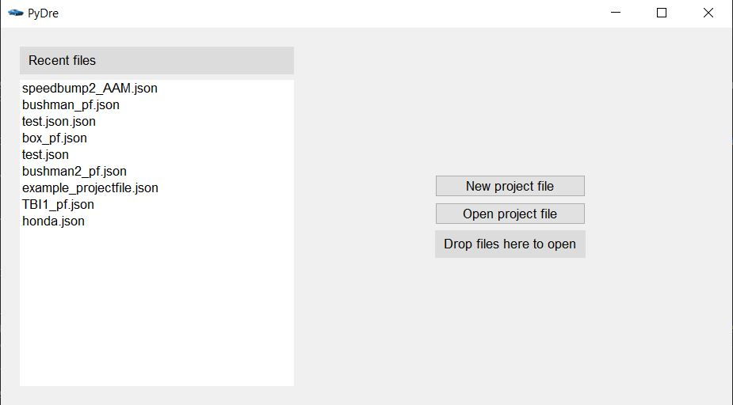

First the user will need to select a project file from either the list of project files under
the recent files heading or the user can make a new project file/select an existing project file from a 
specified file path by clicking the Open Project file button. 

Select the speedbump2_AAM.json project file under the recent files heading as an example shown below

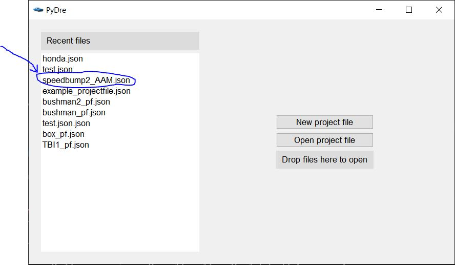

## Editor Page: Project File Configurations

Below is a Screenshot of the Editor Page on the pydre GUI

-  Filters: Add as many filters by clicking the New Filter button at the right and specify the
    function name to be called in pydre as well as any additional paramters under the dropdown for the filter.
    See Example Below to View the smoothGazeData filter for speedbump2_AAM

    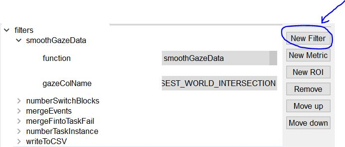

-  Metrics: Similarly Add as many data metrics by clicking the New Metric button at the right and specify the
    fuction name to be called in pydre as well as any additionaly parameters under the dropdown for the metric.
    See Example Below to View the speedbumpHondaGaze2 Metric for speedbump2_AAM

    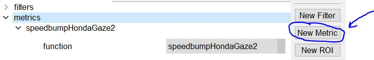

-  Rois: Similarly use the New Roi button to specify the Roi and include a path to the csv file under the dropdown
    for any spatial/temporal Roi and include the column name for a column Roi.
    See Example Below to View the column Roi for speedbump2_AAM

    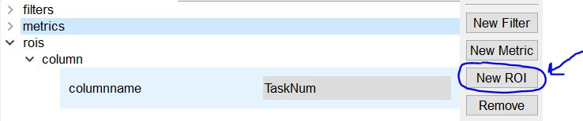

Additional button features are available at the right in order to delete any filters, metrics, and Roi as well as
moving any specified filters, metrics, and Roi up and down on the gui. 
See Screenshot Below for help locating these button features.

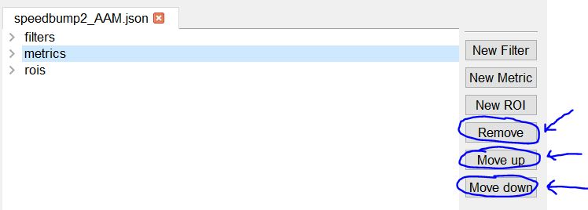

Use the File tab at the top of the gui to open additional project files and save changes when needed.

Use the Edit Tab at the top of the gui to undo or make any additional changes. 

See Screenshot below for help locating these tabs

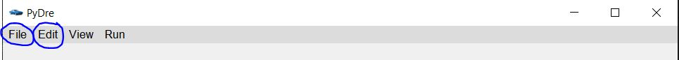

## Run Pydre Application Page

After specifying the project file configurations users can select the Run Tab at the top of the 
gui and click the Run '"your project name"' dropdown to enter the Run Configurations Page
on the gui. See screenshot below for help locating this dropdown.

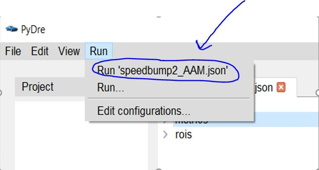

Below is a Screenshot of the Run Page on the GUI.

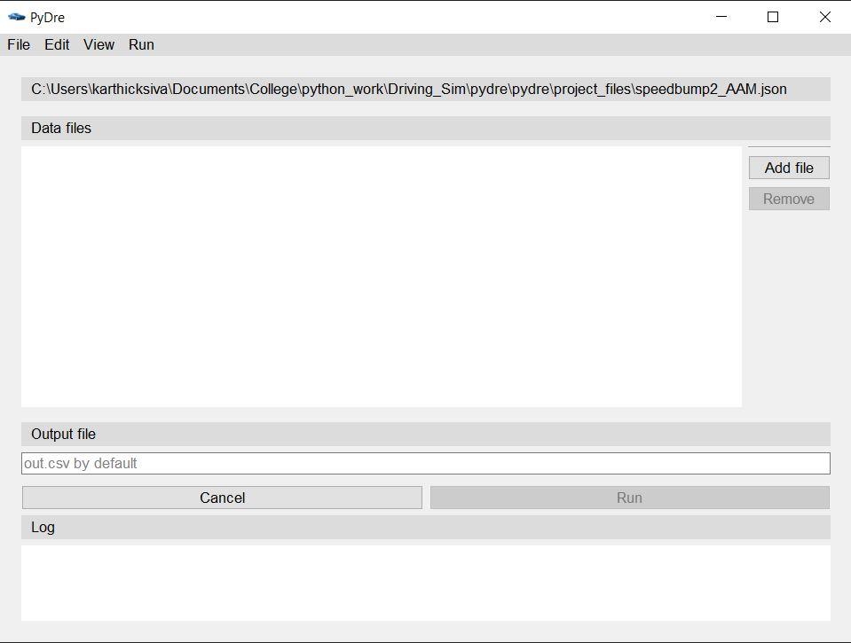

Then, inside the Run Configurations page on the gui, click the Add file button to include the raw data (.dat)
files that are going to be processed by pydre. Then specify an output csv file name in the text area below the
Output File heading or the default out.csv name for the output file will be used. See Screnshot Below
for help locating these areas on Gui.

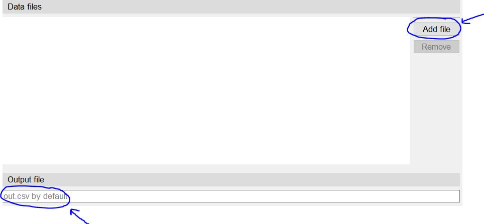

Finally, select the Run button to run the pydre application and view the Log output below the 
Log tab. The Logs can also be viewed by selecting the Log option under the View Tab at the top of the gui.
Select the Cancel button on the page if needed to go back to the editor project configuration page on gui. 
See Screnshot Below for help locating these areas on Gui.

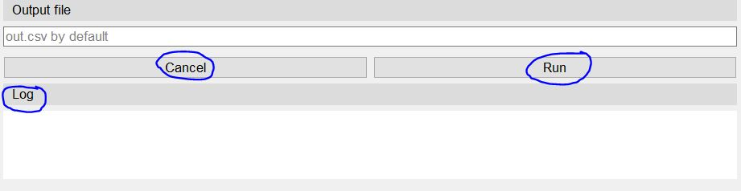

## gui/app.py
Starts and Lanches the GUI application with default configuration settings

## gui/config.py
Updates the config file with any changes stored in the config variable

## gui/customs.py
Includes Widget Functionality for Metrics, Filters, Rois, and all other Project Editing Widgets

## gui/handlers.py
Mediates Pydre Functionality accessed by GUI. Run method runs PyDre conversion and saves the resulting output file

## gui/logger.py
Contains logging output information

## gui/popups.py
Contains PopUp messages information

## gui/templates.py
Configures window UI, icon, and title if given

## gui/windows.py
Handles all tasks related to the main window configurations and functionality
